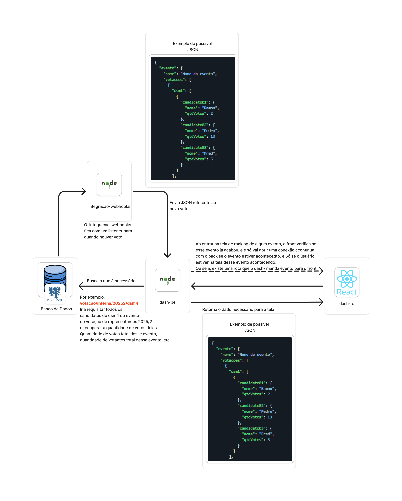

<p align="center">
  <a href="https://fatecregistro.cps.sp.gov.br/" target="blank"></a>
</p>


# <p align="center">Dash e Reports</p>

## 📊 Descrição do Projeto: Dashboards e Relatórios - BACKEND

Este projeto tem como objetivo criar uma plataforma que ofereça em tempo real a visualização do resultados das votações para a instituição.

- **Votação interna** para escolha de representantes de turma.
- **Votação pública** para eleger o melhor projeto das feiras tecnológicas **FTX e HubTec**.

O sistema será projetado para prover auditabilidade, acessibilidade e eficiencia, contando com painéis de controle e relatórios completos.

## 🔧 Arquitetura



## 📦 Componentes

### 🗄️ PostgreSQL
Armazena eventos, candidatos, votos e votantes.

### 🔌 `integracao-webhooks` (Node.js)
- Listener que recebe novos votos do banco de dados.
- Envia os dados atualizados para o backend principal (`dash-be`).

### 🧠 `dash-be` (Node.js)
- Recebe dados dos webhooks.
- Expõe APIs REST para o frontend.
- Consulta o banco de dados.
- Mantém conexão contínua com o frontend (ex: SSE) quando o evento está ativo.

### 💻 `dash-fe` (React)
- Consulta os dados da votação.
- Abre conexão contínua se o evento estiver em andamento.
- Exibe ranking de votos em tempo real.

---

### 🔁 Fluxo de Dados

1. Voto é recebido via webhook (`integracao-webhooks`).
2. Dados atualizados são enviados para o `dash-be`.
3. `dash-be` atualiza a interface do `dash-fe` em tempo real, se aplicável.
4. Caso contrário, o frontend busca os dados consolidados via API REST.

---

### 📄 Exemplo de JSON

```json
{
  "evento": {
    "nome": "Nome do evento",
    "votacoes": [
      {
        "dsm4": [
          {
            "candidato#1": { "nome": "Ramon", "qtdVotos": 2 },
            "candidato#2": { "nome": "Pedro", "qtdVotos": 13 },
            "candidato#3": { "nome": "Fred", "qtdVotos": 5 }
          }
        ]
      }
    ]
  }
}
````

## 🛠️ Tecnologias Utilizadas

- **Back-end**: Javascript | Express.js
- **Banco de Dados**: PostgreSQL 

### ⚠️ Pré-requisitos

Para rodar instale:

- [Node.js](https://nodejs.org/)
- [PostgreSQL](https://www.postgresql.org/) 
- ou [Docker](https://www.docker.com/)

### Configuração do `.env`

Crie um arquivo `.env` na raiz do projeto com as variáveis:

```env
PORT=5000
DB_USERNAME=postgres
DB_PASSWORD=admin
DB_HOST=localhost
DB_NAME=postgresbd
DB_PORT=5432
```
Onde as variaveis significam:
> DB_USERNAME -> Nome de usuário para acesso ao banco <br>
> DB_PASSWORD -> Senha para acesso ao banco <br>
> DB_NAME -> Nome do banco a ser utilizado <br>
> DB_HOST -> Host do servidor onde o banco está. Se usado localmente basta inserir "localhost"

### ✅ Instalação e Execução

1. Clone o repositório:
   ```bash
   git clone https://github.com/laboratorio-de-praticas/dash-be.git
   ```

2. Instale as dependências:
   ```bash
   npm install
   ```

3. Tenha as variaveis de ambiente configuradas no arquivo ".env" como descrito anteriormente.

4. Inicie o servidor backend:
   ```bash
   npm start
   ```

    O backend estará rodando em `http://localhost:5000`.

## 🐋 Rodar com Docker

Se **optar** pelo uso do Docker, siga estas instruções:

1. Modifique o arquivo `.env` para que a variável **DB_HOST** aponte para o container do postgres

    ```env
    PORT=5000
    DB_USERNAME=postgres
    DB_PASSWORD=admin
    DB_HOST=bd
    DB_NAME=postgresbd
    DB_PORT=5432
    ```

2. No terminal, estando na pasta principal do projeto, digite o seguinte comando:
   ```bash
   docker-compose up -d
   ```
3. O serviço do PostgreSQL será iniciado em um contêiner e estará disponível na porta 5432, o serviço do Node estará rodando em `http://localhost:5000`


    ```💡obs: O serviço só será acessível via localhost se você rodar o Docker localmente,   caso tenha feito usando uma VM ou um servidor externo o endereço será outro.```


## 🖋️ Documentação da API
